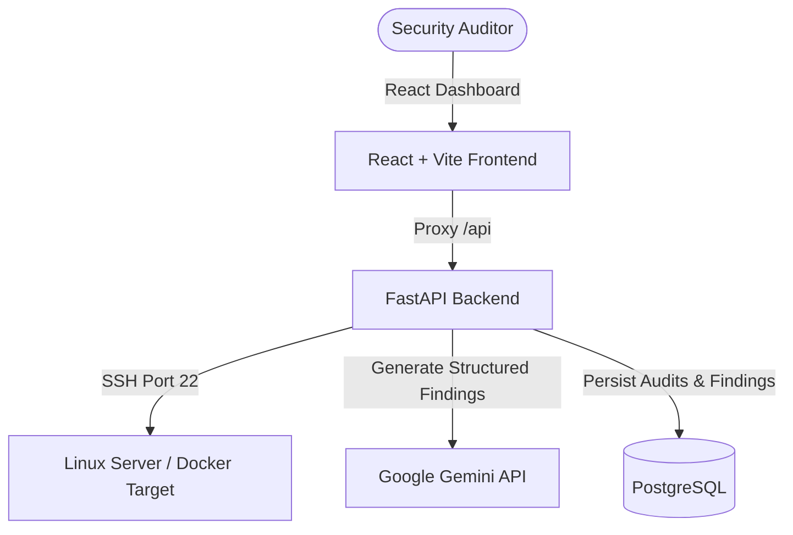

# AI-Powered Linux Hardening Assistant

An automated security auditing and configuration hardening recommendation system for remote Linux servers. The application connects to remote servers via SSH, runs standard security audit commands, aggregates the outputs, feeds the aggregated report to Google Gemini API for intelligent severity classification and mitigation scripts generation, saves results in a PostgreSQL database, and displays them on a premium cyber-security themed React dashboard.

## Architecture Overview



- **Frontend**: React SPA using Vite, Tailwind CSS v4, and React Router. Served in production via Nginx (reverse-proxying API calls to backend).
- **Backend**: FastAPI with Python 3.11, SQLAlchemy ORM, and Pydantic validation schemas.
- **AI Engine**: Google Gemini API (`gemini-2.0-flash`) leveraging prompt engineering for strict structured JSON output and mitigation scripts.
- **Database**: PostgreSQL (persisting reports, severity breakdowns, and command remediations).
- **Audit Targets**: Remote Linux systems connectable via SSH.

---

## Directory Structure

```
ai-linux-security-auditor/
├── backend/                  # FastAPI Application
│   ├── app/                  # Main code base
│   │   ├── config.py         # Config singleton
│   │   ├── database.py       # SQL Alchemy connection & lifecycle
│   │   ├── models.py         # DB ORM schemas
│   │   ├── schemas.py        # Pydantic validation schemas
│   │   ├── services/         # Business logic (SSH, Gemini, DB)
│   │   └── main.py           # Endpoint definitions & exception handling
│   ├── .env.example          # Sample configuration file
│   └── requirements.txt      # Python dependencies
├── frontend/                 # React SPA
│   ├── src/                  # Main component/routing tree
│   │   ├── api/              # Axios API layer
│   │   ├── components/       # Shared layout and UI widgets
│   │   ├── pages/            # Page view controllers
│   │   ├── hooks/            # Custom API state hook stubs
│   │   ├── utils/            # formatting helpers
│   │   └── index.css         # Tailwind v4 theme configurations
│   ├── nginx.conf            # Nginx server block config
│   └── package.json          # Node dependencies
├── docs/                     # Design and logs documentation
│   ├── project_documentation.md
│   └── prompt_documentation.md
├── infrastructure/           # Docker environments
│   └── Dockerfile.audit      # Ubuntu SSH testing image
├── Dockerfile.backend        # Multi-stage python image
├── Dockerfile.frontend       # Build + Nginx image
└── docker-compose.yml        # Orchestration configuration
```

---

## Getting Started

### Prerequisites

- [Docker Desktop](https://www.docker.com/products/docker-desktop/) (running)
- Python 3.11+ (for local development)
- Node.js 20+ (for local development)
- A Google Gemini API key (from [AI Studio](https://aistudio.google.com/app/apikey))

---

### Method 1: Spin up the entire stack using Docker Compose (Recommended)

To build and run all services in containers:

1. **Clone and Navigate**:
   ```bash
   cd ai-linux-security-auditor
   ```

2. **Configure environment**:
   Make sure you set your Gemini API key in your shell:
   ```bash
   # Windows PowerShell
   $env:GEMINI_API_KEY="AIzaSyYourKeyHere..."

   # Linux/macOS
   export GEMINI_API_KEY="AIzaSyYourKeyHere..."
   ```

3. **Orchestrate**:
   ```bash
   docker compose up --build -d
   ```

4. **Verify services**:
   - React Dashboard: `http://localhost:3000`
   - FastAPI swagger documentation: `http://localhost:8000/docs`
   - Postgres server: `localhost:5432`
   - SSH Ubuntu target: `localhost:2222` (credentials: `auditor` / `password123`)

---

### Method 2: Local Development Setup (Manual)

To run backend and frontend servers locally with live hot-reloading:

#### 1. Setup Database & SSH Target
Start only PostgreSQL and the target SSH container via Docker Compose:
```bash
docker compose up postgres audit-target -d
```

#### 2. Run Backend
1. Go to backend directory and copy env variables:
   ```bash
   cd backend
   cp .env.example .env
   # Edit .env and supply GEMINI_API_KEY="your-gemini-key"
   ```
2. Create virtual environment and install packages:
   ```bash
   python -m venv venv
   # Windows
   venv\Scripts\activate
   # Linux/macOS
   source venv/bin/activate

   pip install -r requirements.txt
   ```
3. Run the FastAPI development server:
   ```bash
   python -m uvicorn app.main:app --reload
   ```
   The backend API will run on `http://localhost:8000`.

#### 3. Run Frontend
1. Open another terminal, go to frontend directory:
   ```bash
   cd frontend
   ```
2. Install Node modules:
   ```bash
   npm install
   ```
3. Start Vite dev server:
   ```bash
   npm run dev
   ```
   Vite will serve the frontend at `http://localhost:5173`. Any backend calls will automatically proxy to `http://localhost:8000`.

---

## API Documentation

The FastAPI backend exposes the following REST endpoints:

- **`GET /health`**: Readiness probe. Returns `{"status": "ok"}`.
- **`POST /audit`**: Connects to host via SSH, runs audit commands, executes Gemini AI analyzer, records reports/findings in DB, and returns structured findings.
  - Body:
    ```json
    {
      "host": "localhost",
      "port": 2222,
      "username": "auditor",
      "password": "password123"
    }
    ```
- **`GET /audits`**: Retrieves paginated list of all previous audits with severity counts.
- **`GET /audit/{id}`**: Retrieves complete details of an audit including the raw command outputs and parsed severity findings.

---

## Predefined Auditing Script

The security auditor checks the following configurations out-of-the-box:

1. **SSH Root Login Status**: Checks `PermitRootLogin` config.
2. **SSH Protocol Version**: Assesses SSH configuration options.
3. **Password Aging Policy**: Inspects `/etc/login.defs` settings.
4. **Password Hashing Algorithm**: Checks `/etc/pam.d/common-password` for secure hashing algorithms.
5. **UFW Status**: Audits firewall status.
6. **Sudoers File Config**: Audits password prompts for sudo usage.
7. **Listening Network Ports**: Scans all active TCP/UDP ports.
8. **World-Writable Files**: Highlights insecure file permissions.
9. **No-Owner Files**: Identifies files without valid users/groups.
10. **Shadow File Permissions**: Validates permissions of `/etc/shadow`.
